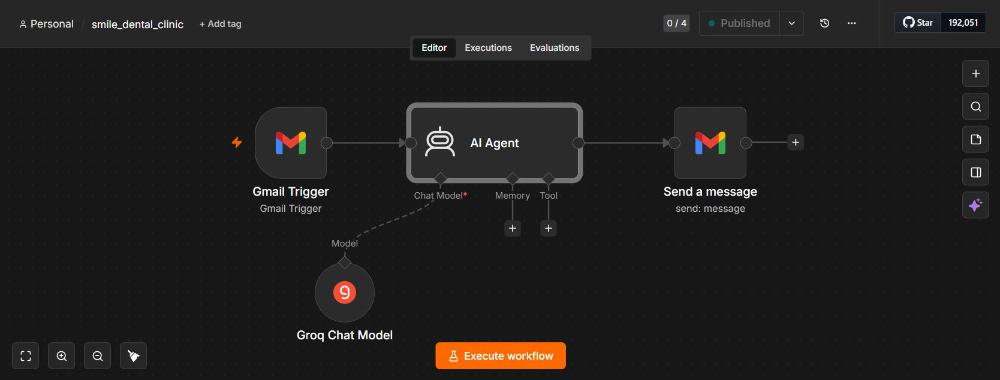
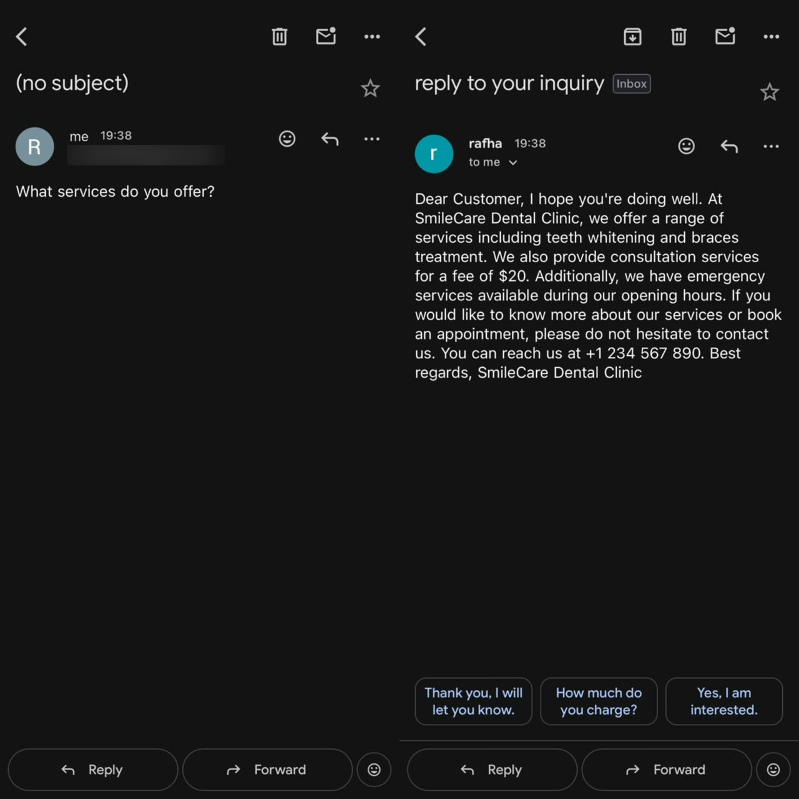
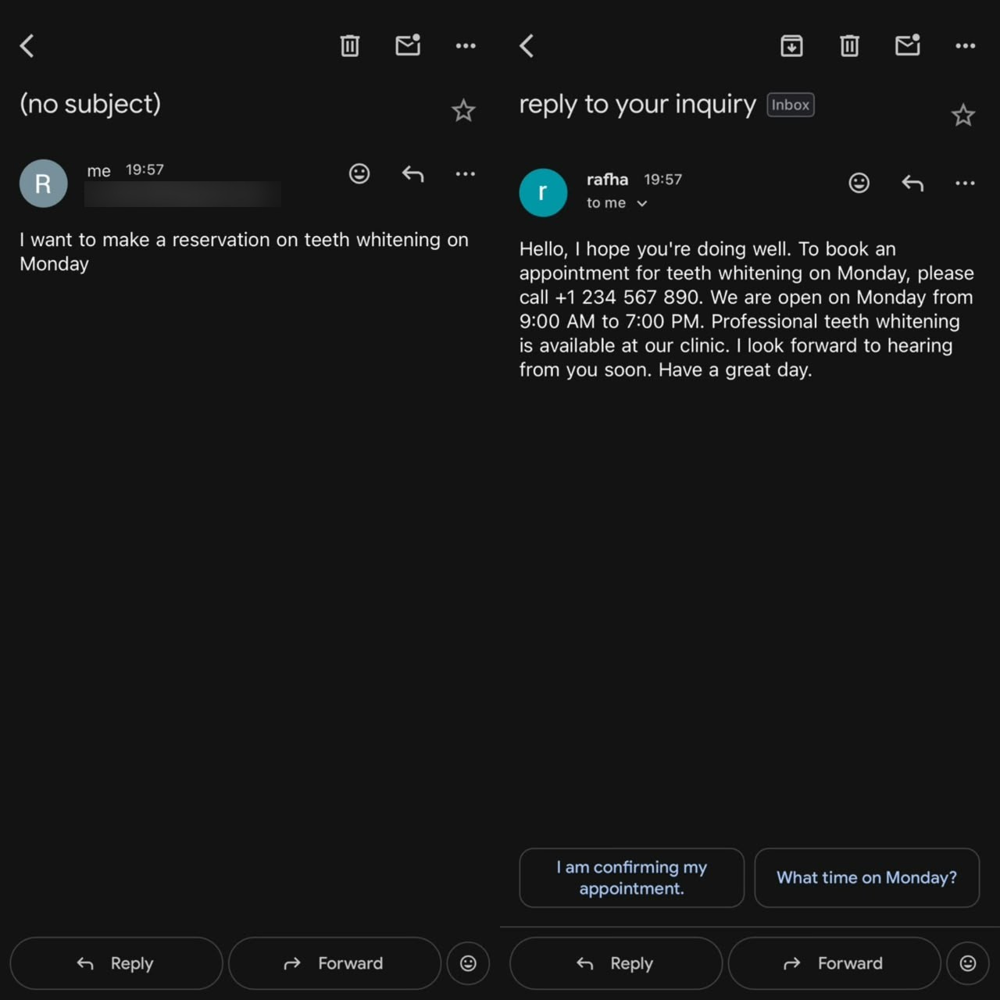
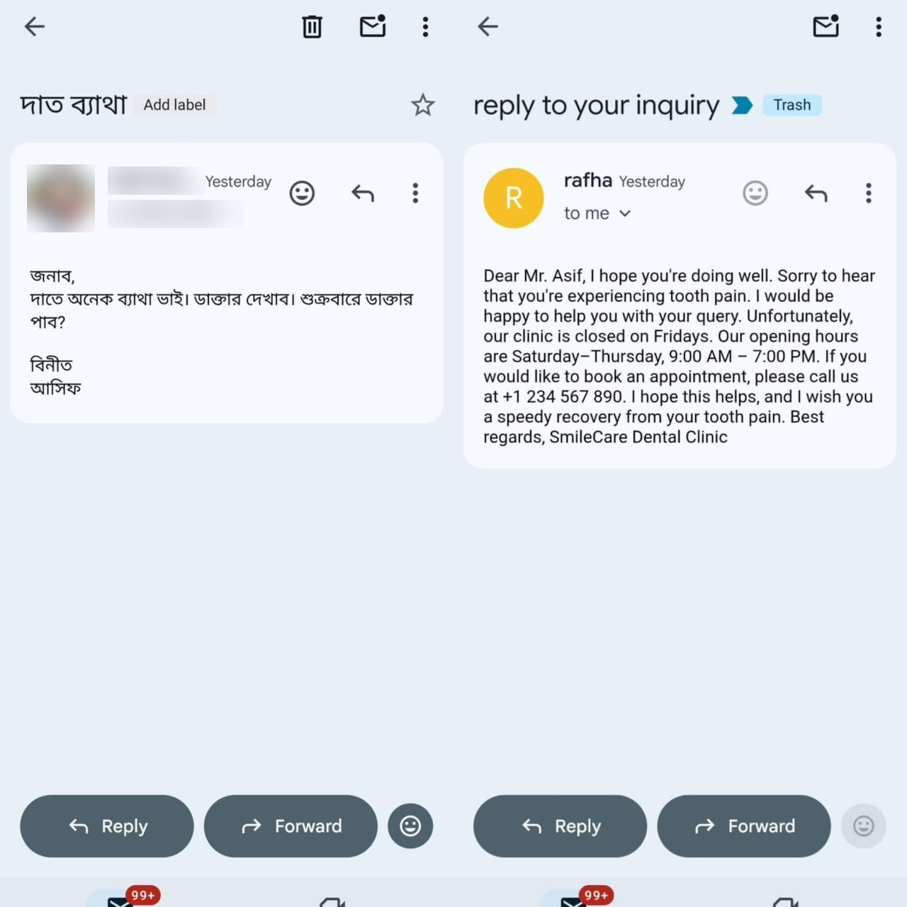
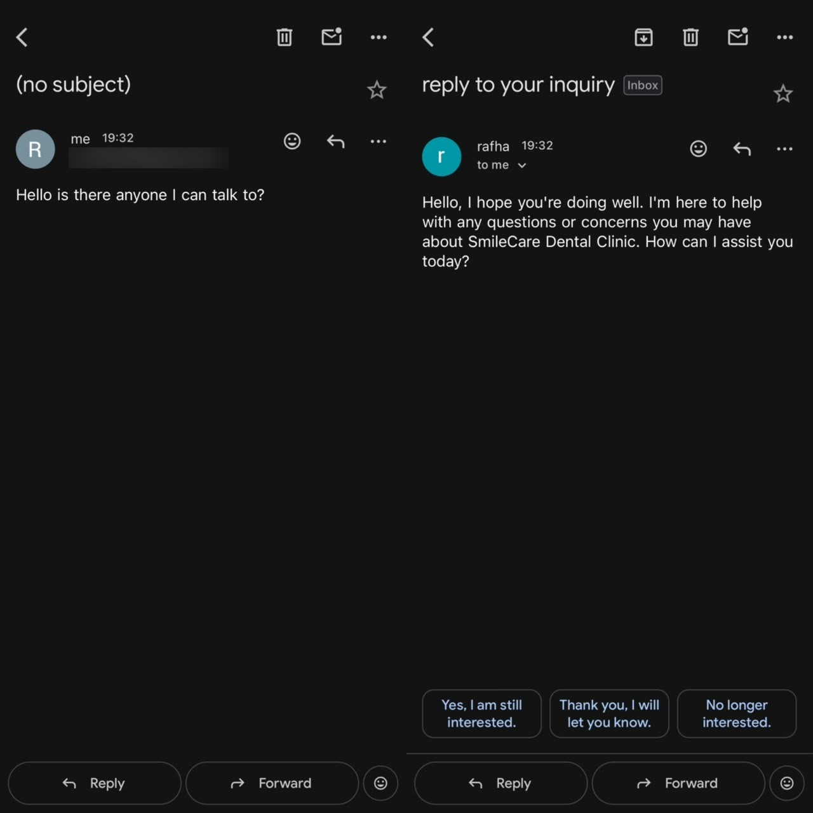
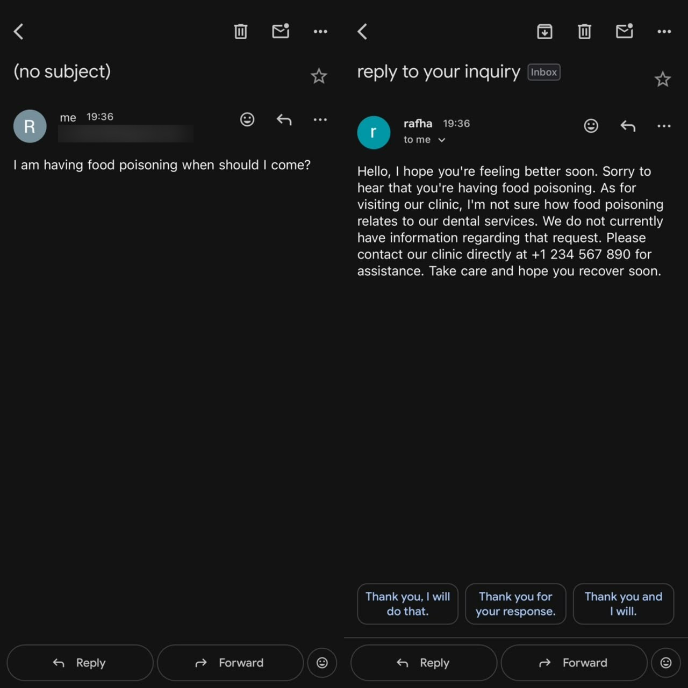
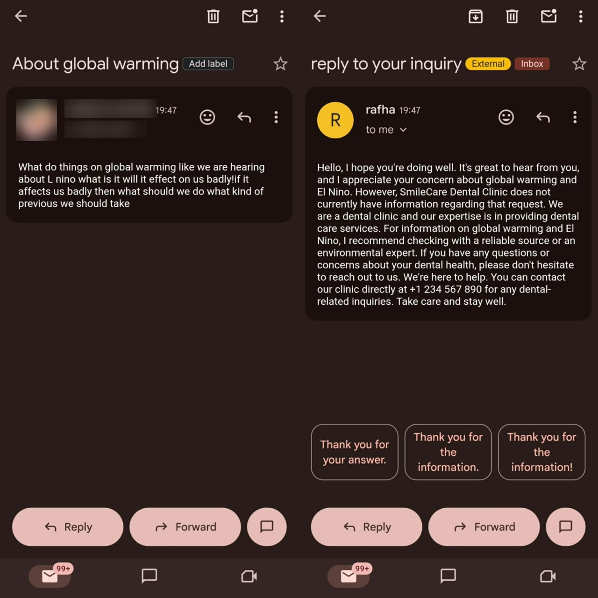

# SmileCare Dental Assistant

An n8n workflow that answers a dental clinic's Gmail inbox by itself. A patient writes in, and within about a minute they get a polite reply written from the clinic's own information and nothing else. If the answer isn't in that information, the reply says so and gives the clinic's phone number.

It runs on Gmail for mail in and out, n8n's AI Agent node for the logic, and Groq's `llama-3.3-70b-versatile` model for the writing.



## The idea

A small clinic's inbox is mostly the same handful of questions. People ask when you're open, what a consultation costs, whether you do braces, and whether they can come in on Friday. Someone at the front desk has to stop and type the same answer again.

The risk with handing that to a language model is that it will guess. Ask it about insurance or Sunday hours and it may invent something plausible, and a patient who turns up on a closed day because an email told them to is worse off than one who got no reply. So the prompt keeps the model inside a short list of facts. It answers from that list, and for anything outside it, it points to the phone line.

## Workflow at a glance

```
┌───────────────┐      ┌──────────────────────┐      ┌─────────────────────┐
│ Gmail Trigger │ ───► │       AI Agent       │ ───► │ Gmail: Send message │
│ every minute  │      │ prompt + clinic info │      │ reply to sender     │
└───────────────┘      └──────────┬───────────┘      └─────────────────────┘
                                  │ ai_languageModel
                     ┌────────────┴─────────────┐
                     │     Groq Chat Model      │
                     │ llama-3.3-70b-versatile  │
                     └──────────────────────────┘
```

An email lands in the inbox. On the next poll, the Gmail Trigger picks it up and passes it to the AI Agent as one item. The agent builds its prompt from the fixed instructions and the email's text, sends that to Groq, and gets back the reply. The Send node then mails that reply to whoever sent the original message.

## Node by node (v1)

This is the workflow in [`workflows/smile_dental_clinic.json`](workflows/smile_dental_clinic.json), the one in the canvas screenshot and in every test below.

### 1. Gmail Trigger

| Setting | Value |
|---|---|
| Node type | `n8n-nodes-base.gmailTrigger` (v1.4) |
| Poll time | Every minute |
| Filters | None |
| Credential | Gmail OAuth2 |

The trigger checks the inbox once a minute and emits every new message it finds. With no filters set, that means every message: patients, newsletters, receipts, anything. Each item carries Gmail's simplified fields, and the workflow uses three of them:

| Field | Used for |
|---|---|
| `snippet` | The email text given to the AI |
| `From` | Where the reply is sent |
| `Subject` | Used in v2's reply subject |

### 2. AI Agent

| Setting | Value |
|---|---|
| Node type | `@n8n/n8n-nodes-langchain.agent` (v3.1) |
| Prompt source | Defined below (`promptType: define`) |
| Chat model | Groq Chat Model (required input) |
| Memory | Not connected |
| Tools | None |

The agent's prompt is one long text field. It holds the role ("You are an AI Email Assistant for SmileCare Dental Clinic"), the clinic facts, the rules, a set of answer guidelines per topic, and at the very end the customer's email pulled in with `{{ $json.snippet }}`. The full text is in [`prompts/system-prompt-v1.txt`](prompts/system-prompt-v1.txt).

With no tools and no memory attached, the agent works as a single prompt-and-answer call. It can't look anything up or remember an earlier email from the same person.

### 3. Groq Chat Model

| Setting | Value |
|---|---|
| Node type | `@n8n/n8n-nodes-langchain.lmChatGroq` (v1) |
| Model | `llama-3.3-70b-versatile` |
| Options | Defaults |
| Credential | Groq API key |

This plugs into the agent's Chat Model slot. Groq was a practical pick here since it's fast and has a free tier, and one call per email is cheap.

### 4. Send a message

| Setting | Value |
|---|---|
| Node type | `n8n-nodes-base.gmail` (v2.2), operation send |
| To | `{{ $('Gmail Trigger').item.json.From }}` |
| Subject | `reply to your inquiry` (fixed text) |
| Message | `{{ $json.output }}` (the agent's reply) |
| Email type | Not set, so Gmail's default (HTML) is used |
| Append n8n attribution | Off |

The recipient is read straight from the trigger node, not from the agent's output, so the reply always goes back to the original sender. Because the email type is left on HTML, line breaks in the model's plain text answer are dropped. That's why every reply in the screenshots arrives as one paragraph.

### Workflow settings

Execution order is `v1` and binary mode is `separate`, both n8n defaults for new workflows. The v1 export is saved as active (published).

## What the assistant knows

Everything the bot is allowed to say comes from this block in the prompt:

| Item | Value |
|---|---|
| Clinic | SmileCare Dental Clinic |
| Opening hours | Saturday to Thursday, 9:00 AM to 7:00 PM |
| Friday | Closed |
| Consultation fee | $20 |
| Teeth whitening | Available |
| Braces treatment | Available |
| Emergency service | Available during opening hours only |
| Appointment booking | Call +1 234 567 890 |

To reuse this for another clinic, change these lines and the matching answer guidelines. The rest of the workflow stays as it is.

## Prompt rules

The v1 prompt tells the model to:

- use only the clinic information and never guess,
- answer anything not covered with: *"We do not currently have information regarding that request. Please contact our clinic directly at +1 234 567 890 for assistance."*,
- never mention that it is an AI,
- skip markdown so the reply can go out as it is,
- keep replies short, polite and clear,
- greet people warmly when they say hello, and reply like a person when the conversation drifts away from clinic topics.

It also has one "if the customer asks about X, say Y" line per topic: hours, booking, fee, whitening, braces, emergencies, and unknowns such as insurance.

## Real test runs

Each screenshot is a real email and the reply the workflow sent. The testers' names, photos and email addresses are blurred.

### Asking what services are offered

> "What services do you offer?"

The reply lists whitening, braces, the $20 consultation and emergency service during opening hours, then gives the booking number. Everything in it comes from the clinic block.



### Trying to book

> "I want to make a reservation on teeth whitening on Monday"

The bot can't book appointments and doesn't pretend to. It confirms Monday is a working day, gives the hours and sends the patient to the phone line.



### A Friday question, in Bengali

> "জনাব, দাতে অনেক ব্যাথা ভাই। ডাক্তার দেখাব। শুক্রবারে ডাক্তার পাব?"
> (My tooth hurts a lot and I want to see a doctor. Can I see one on Friday?)

It picked up the Friday question from a Bengali email, said the clinic is closed on Fridays, listed the working days and wished the patient a quick recovery. The reply came back in English, though. v2 fixes that.



### Just saying hello

> "Hello is there anyone I can talk to?"



### A health problem that isn't dental

> "I am having food poisoning when should I come?"

The reply is sympathetic, says the clinic has no information on this and gives the phone number. It doesn't try to give medical advice.



### Something off topic

> "What do things on global warming like we are hearing about El Niño..."

It stays friendly, explains that SmileCare is a dental clinic and suggests an environmental source for the question.



## Version 2

[`workflows/dental_assistant_v2.json`](workflows/dental_assistant_v2.json) is a reworked version based on what the tests showed. Its prompt is saved in [`prompts/system-prompt-v2.txt`](prompts/system-prompt-v2.txt).

The flow gains one node:

```
Gmail Trigger ──► Wait ──► AI Agent ──► Send a message
                              ▲
                      Groq Chat Model
```

Changes from v1:

| Area | v1 | v2 |
|---|---|---|
| Nodes | 4 | 5 (adds a Wait node, `n8n-nodes-base.wait` v1.1, on default settings) |
| Reply language | Always English | Same language as the customer's email (English, Spanish and Bengali are named in the prompt) |
| Reply subject | Fixed: "reply to your inquiry" | `Re: {{ $('Gmail Trigger').item.json.Subject }}` so replies thread under the original |
| Email type | HTML (default) | Plain text, so line breaks survive |
| Opening line | Free | Always "Thank you for contacting SmileCare Dental Clinic." (translated if needed) |
| Closing line | Free | Always "We look forward to assisting you.", signed "Best Regards, Smile Care Team" |
| Mixed questions | Not covered | Answer what's known, then flag only the unknown parts |
| Booking number | Given often | Only when someone asks to book or asks for contact details |
| Clinic facts | Same | Same |

The v2 export is saved inactive, so it has to be published after import.

## Setup

You need an n8n instance (Cloud or self-hosted), a Gmail account for the clinic inbox, and a Groq API key from [console.groq.com](https://console.groq.com).

1. In n8n, open **Workflows**, choose **Import from File**, and pick one of the files in `workflows/`.
2. Open the Gmail Trigger and the Send a message node and select your own Gmail OAuth2 credential. The credential IDs saved in the JSON belong to the original instance and won't resolve on yours.
3. Open the Groq Chat Model node and select your Groq credential.
4. Edit the clinic information in the AI Agent prompt if you're adapting it.
5. Send a test email to the inbox, click **Execute workflow**, and read the reply that comes back.
6. Publish the workflow once the replies look right.

## Known limitations

- **It replies to everything.** The trigger has no filters, so promotions, receipts and no-reply senders get an answer too. A Gmail search filter on the trigger, something like `-category:promotions -category:social -from:noreply`, would cut most of that.
- **It only reads the snippet.** `snippet` is Gmail's short preview of roughly 200 characters. Questions further down a long email never reach the model. Switching the trigger off Simplify and using the full body would fix it.
- **No memory.** Each email is handled on its own, so a follow-up like "what about Saturday then?" has no context. The agent's Memory slot is open for this.
- **v1 replies only in English and as one paragraph**, for the reasons covered above. v2 addresses both.
- **v2 puts the subject inside the body.** Its prompt asks the model to print `Subject:` and `Body:` lines, while the Send node sets the subject separately, so those labels end up in the email text. Either drop that output format from the prompt or split the text before sending.
- **v2 reads the subject two ways.** The prompt uses `{{ $json.Subject }}` in one place and `{{ $json.subject }}` in another. Gmail's field is `Subject`, so the lowercase one renders empty.
- **A leftover line in v1's prompt** says "Do not add extra text outside the JSON", but the workflow sends plain text. It does no harm and can be removed.
- The clinic name and phone number are demo placeholders.

## Repo layout

```
dental-assistant/
├── README.md
├── workflows/
│   ├── smile_dental_clinic.json     # v1, the tested workflow
│   └── dental_assistant_v2.json     # v2, multilingual with threaded replies
├── prompts/
│   ├── system-prompt-v1.txt
│   └── system-prompt-v2.txt
└── screenshots/
    ├── workflow-canvas.png
    └── demo-*.jpeg                  # six test emails and their replies
```

## Stack

n8n with the LangChain AI Agent node, the Gmail API over OAuth2, and Groq running Llama 3.3 70B Versatile.

Built by [@ismam-tasnime](https://github.com/ismam-tasnime).
